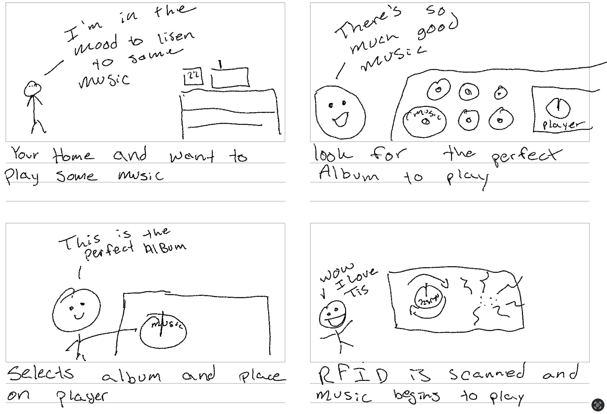
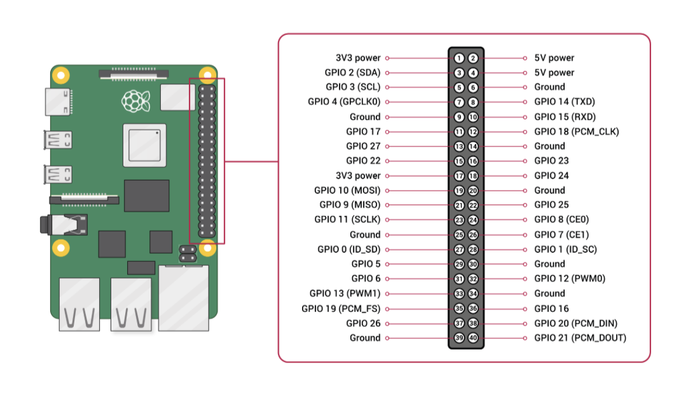
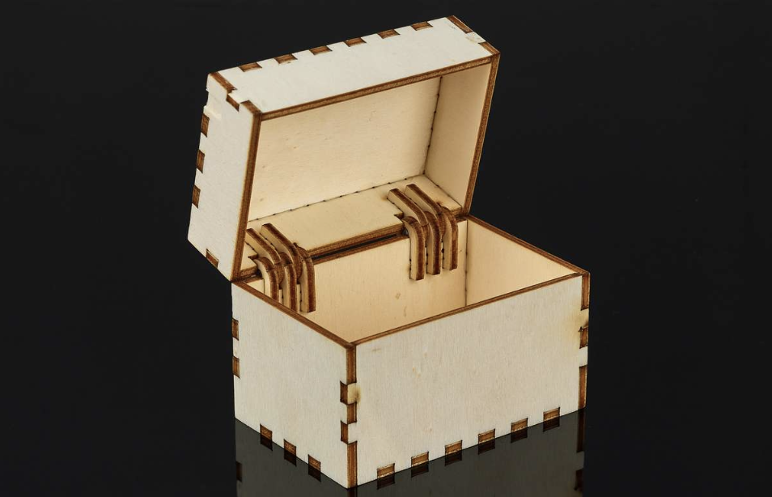
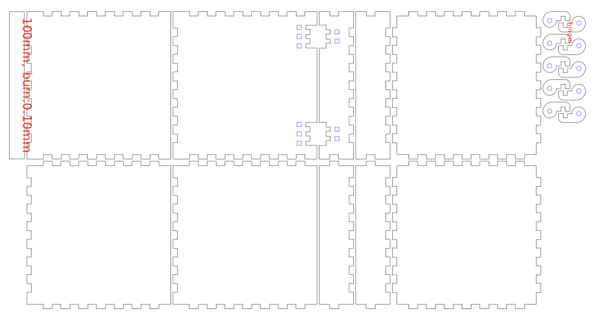
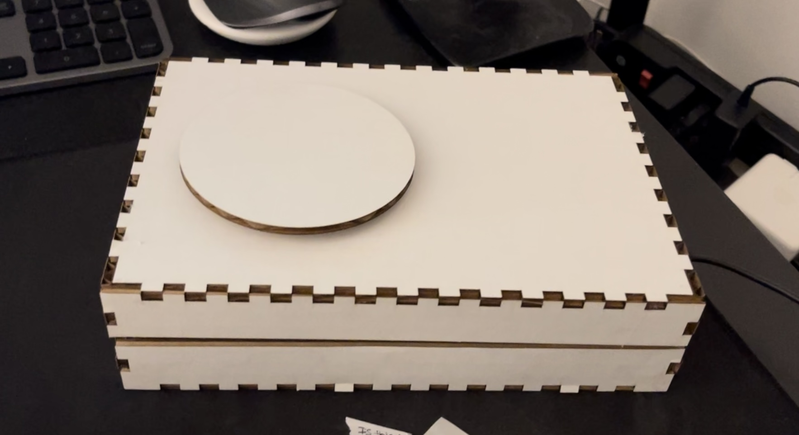
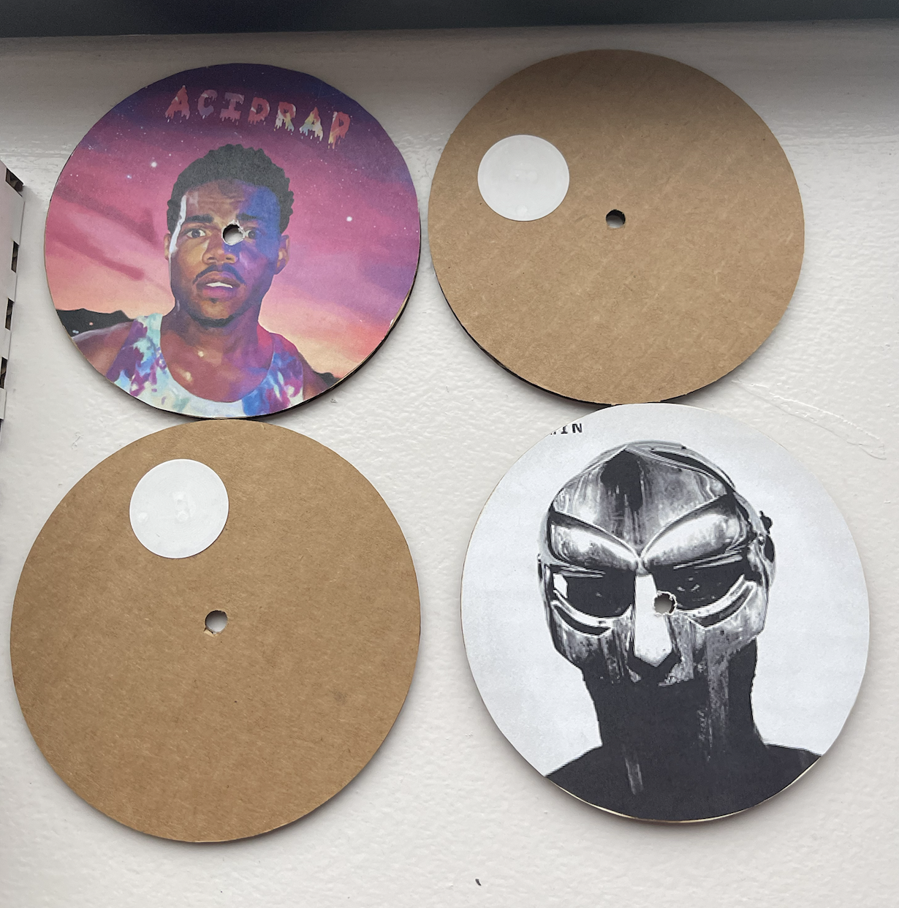
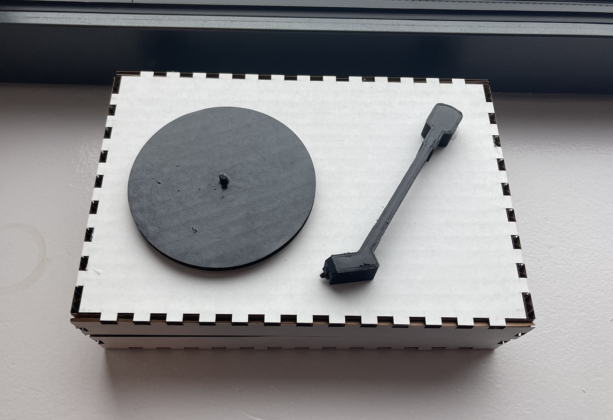
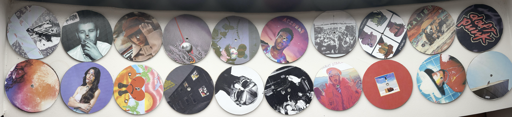

# Digital Vinyl Player

## Team Members
 Joseph Iovine (jai47)

 Carlos Ponce (cmp279)

## Idea and Inspiration
Traditional record players are very large in addition to the fact that collecting records becomes a pretty expensive hobby. However, lets be honest a large portion of the reason people get into this hobby is not because of the love for vinyl records, but rather the aesthetic of being able to go through a collection of physical albums and watch your music come to life on the turn-table. Our solution to this is to create a “digital vinyl player” that uses RFID technology along with a Raspberry Pi and spotipy to play physical albums from spotify. The device will mimic a turntable by using a servo motor where the motor will start to spin when it detects an album on top of it, and the RFID scanner will read the album and start to play it from spotify. The user will still get the enjoyment of the aesthetic of physical albums in a much smaller and cheaper form factor.

<center></center>
<center></center>

## What You'll Need
* Rasperry Pi
* Continuous Servo Motor
    * We used a [SpringRC SM-S4303R](https://www.pololu.com/product/1248) continuous rotation servo
* RFID Scanner
    * We used a [Mifare RC522 RF IC Card Sensor Module](https://www.amazon.com/dp/B07VLDSYRW?psc=1&ref=ppx_yo2ov_dt_b_product_details)
    * *Note: This will require soldering*
* RFID Tags
    * Can purchase 50 [YARONGTECH RFID](https://www.amazon.com/dp/B01LZYOR7P?psc=1&ref=ppx_yo2ov_dt_b_product_details) sticker tags here
* Female to female jumper wires
    * We used [Fielect Dupont Jumper Wires](https://www.amazon.com/dp/B081N3G8NT?psc=1&ref=ppx_yo2ov_dt_b_product_details)
* [Zio 16 Servo Controller](https://www.sparkfun.com/products/16773)
* 3xAA Battery Holder with JST connector
    * We used [this one](https://www.sparkfun.com/products/18769) from sparkfun
* [Qwiic connect to female jumper cable](https://www.sparkfun.com/products/15081)
* Some type of small speaker
    * We used a [JBL Clip 4](https://www.amazon.com/JBL-Portable-Waterproof-Wireless-Bluetooth/dp/B09F86FDKH/ref=sr_1_4?keywords=jbl+clip+4&qid=1670614265&sr=8-4&ufe=app_do%3Aamzn1.fos.006c50ae-5d4c-4777-9bc0-4513d670b6bc) but any small form factor speaker will work
* A lot of cardboard
* Access to a printer (for the records)
* Ideally have access to a laser cutter and 3D-Printer for the device box and turn-table needle
* A spotify premium account
* A computer with internet access

## Device Setup

### The Hardware

First, solder the 8-pin header that came with the RFID Scanner to the RFID module.

Next we will connect the RFID module and continuous servo motor to the RPi. Using the diagram below we will start with the RFID module.
* SDA connects to Pin 24
* SCK connects to Pin 23
* MOSI connects to Pin 19
* MISO connects to Pin 21
* GND connects to Pin 20
* RST connects to Pin 22
* 3.3V connects to Pin 17

Now for the continuous servo motor, we use the Qwiic connect to female jumper cable to connect the Zio 16 servo controller to the Rpi. The cable follows this color scheme: Black = GND, Red = 3.3V, Blue = SDA, Yellow = SCL. Connect the Qwiic side to the Zio 16 and the female side to the Rpi using the diagram below.
* SDA connects to Pin 3
* SCL connects to Pin 5
* 3.3V connects to Pin 1
* GND connects to Pin 6

<center></center>

Lastly connect the SpringRC SM-S4303R continuous servo motor to channel 0 of the Zio 16 controller along with the 3xAA battery pack to JST power connector on the controller.

Since our speaker connects via bluetooth to the Rpi we are all finished with the hardware!

### The Code

All of the code can be found in [final_project.py](<https://github.com/jiovine/Interactive-Lab-Hub/blob/240beadf2fb6a776977c249159a5d22ccb53848c/Final Project/final_project.py>) with comments, so I will only be going over how to play Spotify songs out of the Rpi using Raspotify, and how to control Spotify remotely using Spotipy.

I followed [this Raspotify tutorial](https://pimylifeup.com/raspberry-pi-spotify/) along with [this Spotipy tutorial](https://medium.com/@maxtingle/getting-started-with-spotifys-api-spotipy-197c3dc6353b) to get the two packages up and running and working together on my Rpi.

After setting up Raspotify and Spotipy we can retrieve the Device ID of the Rpi from the Spotify for Developers page that was used during the Spotipy setup. Using this device ID we can now force play songs from the Rpi!

Two things that I would like to highlight in the code: the spotify authentication and how to make the RFID tag ID's play the correct albums.

The spotify authentication:
```python
sp = spotipy.Spotify(auth_manager=SpotifyOAuth(
                    client_id=CLIENT_ID,
                    client_secret=CLIENT_SECRET,
                    redirect_uri="http://localhost:8080",
                    scope="user-read-playback-state,user-modify-playback-state"))
```
Creating this instance of a Spotipy class allows you to interact with the Spotify Web API with any of the methods found in the extensive [Spotipy documentation](https://spotipy.readthedocs.io/en/2.21.0/) to basically do anything with spotify from within a python script.

In addition to the [final_project.py](<https://github.com/jiovine/Interactive-Lab-Hub/blob/240beadf2fb6a776977c249159a5d22ccb53848c/Final Project/final_project.py>) file, I created an additional file [album_list.py](https://github.com/jiovine/Interactive-Lab-Hub/blob/Fall2022/Final%20Project/album_list.py) that stores the RFID tags as keys in a dictionary, with their corresponding value being a spotify album URI that we can then use:
```python
sp.start_playback(device_id=DEVICE_ID, context_uri=status)
```
to start playing the album, where ```status``` is the corresponding URI for the album that is scanned and is retrieved from a getter function inside [album_list.py](https://github.com/jiovine/Interactive-Lab-Hub/blob/Fall2022/Final%20Project/album_list.py).

## Design

### The Record Player and the "Vinyl" Records
Because our idea was a record player we always knew we wanted a rectangular shape for our design. We wanted to imitate the design of larger record players. The size of our design came from the box of components we received at the beginning of the semester. We realized it perfectly fit everything we just needed to figure out the correct layout. Once we saw everything fit we measured the box and used [this link](https://www.festi.info/boxes.py/HingeBox?language=en) to cut out a box with hinges. The box would look like this:

<center></center>

And using the following template we were able to laser cut the pieces:

<center></center>

With the box built we refit our inside to measure the hole for our motor. We had forgotten about this element and luckily because we went with a hinge we just had to open it and place it in the laser cuter. We cut a 4 inch hole on the top. We were not happy with the opening and had to cut a bit more. The ugly shape we had on the top of our box would be covered so it was not a reason to start over. 

<center></center>

We then began cutting our "Vinyl Records.” We cut 4 inch circles with a hole in the middle that we would use as records. One of these circles would be the base and taped onto the servo motor. Our records had an rfid sticker on once side and the album art cover on the other. We really loved this idea since it was obvious which record was which.

<center></center>

With that our record player was done! We figured that with the extra time we had we could add some extra flair. We decided to 3D print a record player needle. We found a design we liked online and threw it into the printer. It wouldn’t have functionality but in the future we wanted to use the needle to play and pause songs. Adding some paint and attaching the needle:

<center></center>

## Internals

Inside our finished box design we were able to fit all the components very easily and only had to worry about the positioning of the RFID scanner inside of the box. We chose to place it under the left side of the turn-table but had two concerns: will it be able scan through the cardboard from about 1.5 inches away, and how would the user know how to "correctly" place the record onto the turn-table (since the RFID tags were only in one spot on the records). The first concern was alleviated during testing since the RFID scanner did a very good job on reading through cardboard. As for the second concern, we decided to allow the servo to continuously rotate since it gave the user the ability to place the record on in any orientation. Since the motor is always running, eventually the tag will pass over the RFID scanner and play the corresponding album.

<center></center>

## Photos of Final Product

<center></center>


<center></center>

## Demo
Demo of the final product.

[](https://drive.google.com/file/d/1aZlFwZeGD1GsZawRl8VL8va01FeMVpWV/view?usp=sharing)