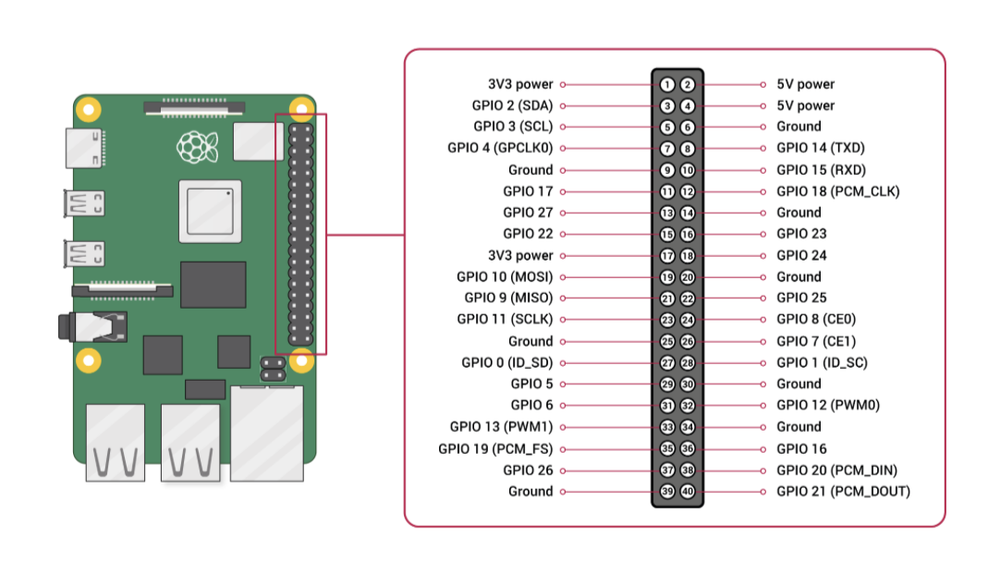

# Digital Vinyl Player

## Team Members
 Joseph Iovine (jai47)

 Carlos Ponce (cmp279)

## Idea and Inspiration
Traditional record players are very large in addition to the fact that collecting records becomes a pretty expensive hobby. However, lets be honest a large portion of the reason people get into this hobby is not because of the love for vinyl records, but rather the aesthetic of being able to go through a collection of physical albums and watch your music come to life on the turn-table. Our solution to this is to create a “digital vinyl player” that uses RFID technology along with a Raspberry Pi and spotipy to play physical albums from spotify. The device will mimic a turntable by using a servo motor where the motor will start to spin when it detects an album on top of it, and the RFID scanner will read the album and start to play it from spotify. The user will still get the enjoyment of the aesthetic of physical albums in a much smaller and cheaper form factor.

## What You'll Need
* Rasperry Pi
* Continuous Servo Motor
    * We used a [SpringRC SM-S4303R](https://www.pololu.com/product/1248) continuous rotation servo
* RFID Scanner
    * We used a [Mifare RC522 RF IC Card Sensor Module](https://www.amazon.com/dp/B07VLDSYRW?psc=1&ref=ppx_yo2ov_dt_b_product_details)
    * *Note: This will require soldering*
* RFID Tags
    * Can purchase 50 [YARONGTECH RFID](https://www.amazon.com/dp/B01LZYOR7P?psc=1&ref=ppx_yo2ov_dt_b_product_details) sticker tags here
* Female to female jumper wires
    * We used [Fielect Dupont Jumper Wires](https://www.amazon.com/dp/B081N3G8NT?psc=1&ref=ppx_yo2ov_dt_b_product_details)
* [Zio 16 Servo Controller](https://www.sparkfun.com/products/16773)
* 3xAA Battery Holder with JST connector
    * We used [this one](https://www.sparkfun.com/products/18769) from sparkfun
* [Qwiic connect to female jumper cable](https://www.sparkfun.com/products/15081)
* Some type of small speaker
    * We used a [JBL Clip 4](https://www.amazon.com/JBL-Portable-Waterproof-Wireless-Bluetooth/dp/B09F86FDKH/ref=sr_1_4?keywords=jbl+clip+4&qid=1670614265&sr=8-4&ufe=app_do%3Aamzn1.fos.006c50ae-5d4c-4777-9bc0-4513d670b6bc) but any small form factor speaker will work
* A lot of cardboard
* Access to a printer (for the records)
* Ideally have access to a laser cutter and 3D-Printer for the device box and turn-table needle
* A spotify premium account
* A computer with internet access

## Device Setup

### The Hardware

First, solder the 8-pin header that came with the RFID Scanner to the RFID module.

Next we will connect the RFID module and continuous servo motor to the RPi. Using the diagram below we will start with the RFID module.
* SDA connects to Pin 24
* SCK connects to Pin 23
* MOSI connects to Pin 19
* MISO connects to Pin 21
* GND connects to Pin 20
* RST connects to Pin 22
* 3.3V connects to Pin 17

Now for the continuous servo motor, we use the Qwiic connect to female jumper cable to connect the Zio 16 servo controller to the Rpi. The cable follows this color scheme: Black = GND, Red = 3.3V, Blue = SDA, Yellow = SCL. Connect the Qwiic side to the Zio 16 and the female side to the Rpi using the diagram below.
* SDA connects to Pin 3
* SCL connects to Pin 5
* 3.3V connects to Pin 1
* GND connects to Pin 6

Lastly connect the SpringRC SM-S4303R continuous servo motor to channel 0 of the Zio 16 controller along with the 3xAA battery pack to JST power connector on the controller.

Since our speaker connects via bluetooth to the Rpi we are all finished with the hardware!

### The Code

All of the code can be found in [final_project.py](https://github.com/jiovine/Interactive-Lab-Hub/blob/Fall2022/Final) with comments, so I will only be going over how to play Spotify songs out of the Rpi using Raspotify, and how to control Spotify remotely using Spotipy.

I followed [this Raspotify tutorial](https://pimylifeup.com/raspberry-pi-spotify/) along with [this Spotipy tutorial](https://medium.com/@maxtingle/getting-started-with-spotifys-api-spotipy-197c3dc6353b) to get the two packages up and running and working together on my Rpi.

Spotipy has [extensive documentation](https://spotipy.readthedocs.io/en/2.21.0/) to basically do anything with spotify from within a python script

## Design

### The Record Player
* Thoughts behind the design
* Where we got the design from
* How we laser cut and assembled
* 3D printing the needle

### The "Vinyl" Records
* How we made the records

## Photos of Final Product

## Demo
Demo of the final product.

