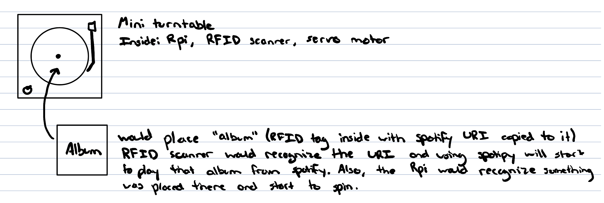
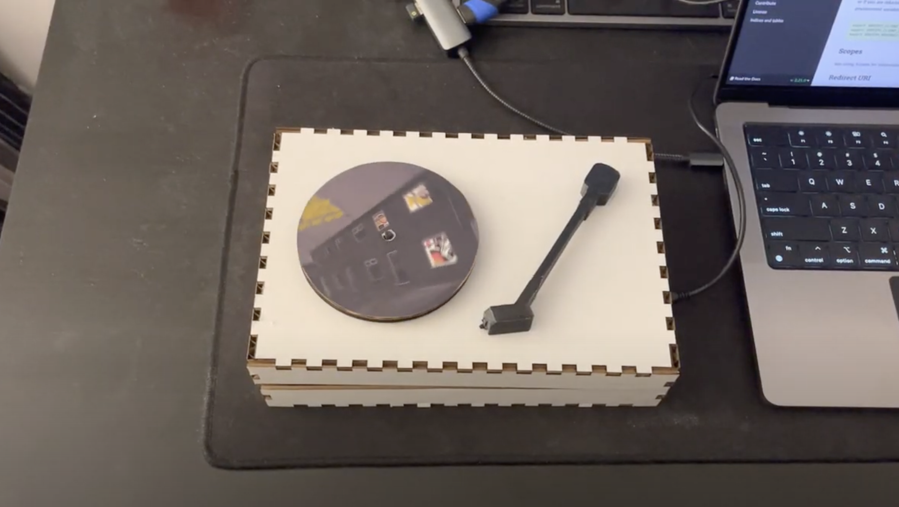

# Digital Vinyl Player

## Team Members
 Joseph Iovine (jai47)

 Carlos Ponce (cmp279)

## Idea and Inspiration
Traditional record players are very large in addition to the fact that collecting records becomes a pretty expensive hobby. However, lets be honest a large portion of the reason people get into this hobby is not because of the love for vinyl records, but rather the aesthetic of being able to go through a collection of physical albums and watch your music come to life on the turn-table. Our solution to this is to create a “digital vinyl player” that uses RFID technology along with a Raspberry Pi and spotipy to play physical albums from spotify. The device will mimic a turntable by using a servo motor where the motor will start to spin when it detects an album on top of it, and the RFID scanner will read the album and start to play it from spotify. The user will still get the enjoyment of the aesthetic of physical albums in a much smaller and cheaper form factor.

## What You'll Need
* Rasperry Pi
* Continuous Servo Motor
    * We used a [SpringRC SM-S4303R](https://www.pololu.com/product/1248) continuous rotation servo
* RFID Scanner
    * We used a [Mifare RC522 RF IC Card Sensor Module](https://www.amazon.com/dp/B07VLDSYRW?psc=1&ref=ppx_yo2ov_dt_b_product_details)
    * *Note: This will require soldering*
* RFID Tags
    * Can purchase 50 [YARONGTECH RFID](https://www.amazon.com/dp/B01LZYOR7P?psc=1&ref=ppx_yo2ov_dt_b_product_details) sticker tags here
* Female to female jumper wires
    * We used [Fielect Dupont Jumper Wires](https://www.amazon.com/dp/B081N3G8NT?psc=1&ref=ppx_yo2ov_dt_b_product_details)
* Some type of small speaker
    * We used a [JBL Clip 4](https://www.amazon.com/JBL-Portable-Waterproof-Wireless-Bluetooth/dp/B09F86FDKH/ref=sr_1_4?keywords=jbl+clip+4&qid=1670614265&sr=8-4&ufe=app_do%3Aamzn1.fos.006c50ae-5d4c-4777-9bc0-4513d670b6bc) but any small form factor speaker will work
* A lot of cardboard
* Access to a printer (for the records)
* Ideally have access to a laser cutter and 3D-Printer for the device box and turn-table needle
* A spotify premium account
* A computer with internet access

## Device Setup

### The Record Player

### The "Vinyl" Albums

## The Code

## Photos of Final Product

## Demo
