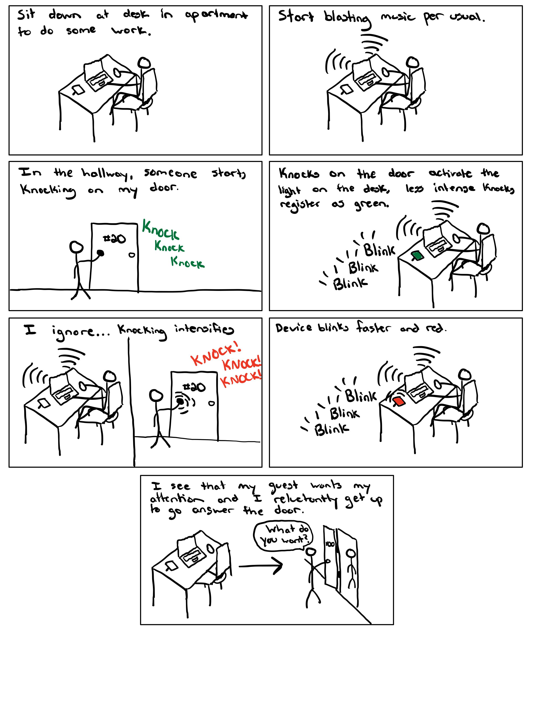
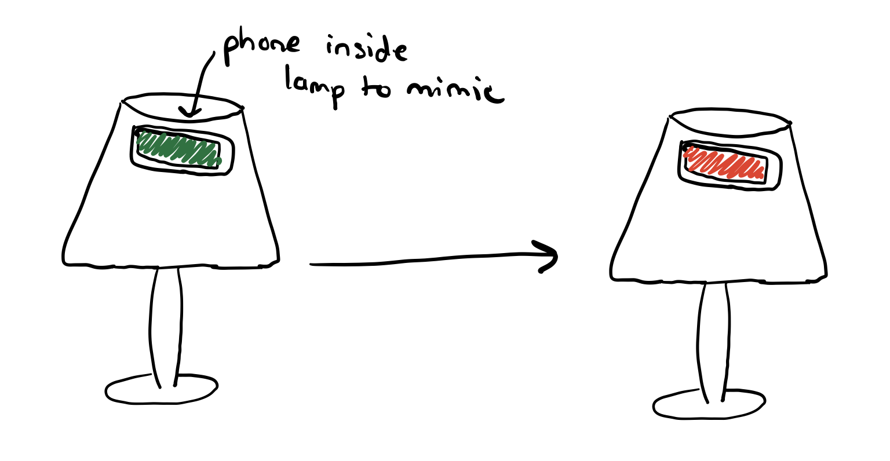
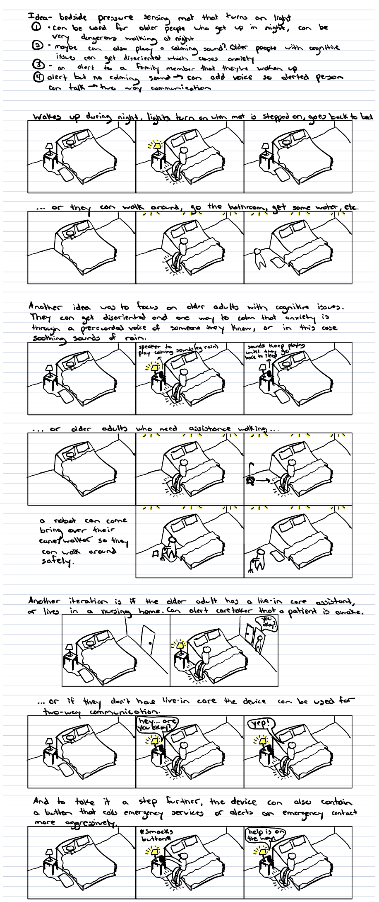
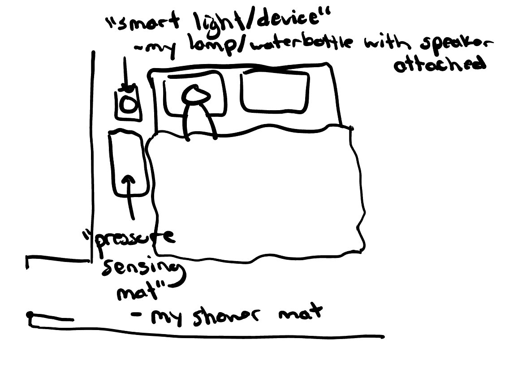

# Staging Interaction

In the original stage production of Peter Pan, Tinker Bell was represented by a darting light created by a small handheld mirror off-stage, reflecting a little circle of light from a powerful lamp. Tinkerbell communicates her presence through this light to the other characters. See more info [here](https://en.wikipedia.org/wiki/Tinker_Bell). 

There is no actor that plays Tinkerbell--her existence in the play comes from the interactions that the other characters have with her.

For lab this week, we draw on this and other inspirations from theatre to stage interactions with a device where the main mode of display/output for the interactive device you are designing is lighting. You will plot the interaction with a storyboard, and use your computer and a smartphone to experiment with what the interactions will look and feel like. 

_Make sure you read all the instructions and understand the whole of the laboratory activity before starting!_

## Prep

### To start the semester, you will need:
1. Read about Git [here](https://git-scm.com/book/en/v2/Getting-Started-What-is-Git%3F).
2. Set up your own Github "Lab Hub" repository to keep all you work in record by [following these instructions](https://github.com/FAR-Lab/Developing-and-Designing-Interactive-Devices/blob/2021Fall/readings/Submitting%20Labs.md).
3. Set up the README.md for your Hub repository (for instance, so that it has your name and points to your own Lab 1) and [learn how to](https://guides.github.com/features/mastering-markdown/) organize and post links to your submissions on your README.md so we can find them easily.

### For this lab, you will need:
1. Paper
2. Markers/ Pens
3. Scissors
4. Smart Phone -- The main required feature is that the phone needs to have a browser and display a webpage.
5. Computer -- We will use your computer to host a webpage which also features controls.
6. Found objects and materials -- You will have to costume your phone so that it looks like some other devices. These materials can include doll clothes, a paper lantern, a bottle, human clothes, a pillow case, etc. Be creative!

### Deliverables for this lab are: 
1. 7 Storyboards
1. 3 Sketches/photos of costumed devices
1. Any reflections you have on the process
1. Video sketch of 3 prototyped interactions
1. Submit the items above in the lab1 folder of your class [Github page], either as links or uploaded files. Each group member should post their own copy of the work to their own Lab Hub, even if some of the work is the same from each person in the group.

### The Report
This README.md page in your own repository should be edited to include the work you have done (the deliverables mentioned above). Following the format below, you can delete everything but the headers and the sections between the **stars**. Write the answers to the questions under the starred sentences. Include any material that explains what you did in this lab hub folder, and link it in your README.md for the lab.

## Lab Overview
For this assignment, you are going to:

A) [Plan](#part-a-plan) 

B) [Act out the interaction](#part-b-act-out-the-interaction) 

C) [Prototype the device](#part-c-prototype-the-device)

D) [Wizard the device](#part-d-wizard-the-device) 

E) [Costume the device](#part-e-costume-the-device)

F) [Record the interaction](#part-f-record)

Labs are due on Mondays. Make sure this page is linked to on your main class hub page.

## Part A. Plan 

To stage an interaction with your interactive device, think about:

_Setting:_ Where is this interaction happening? (e.g., a jungle, the kitchen) When is it happening?

_Players:_ Who is involved in the interaction? Who else is there? If you reflect on the design of current day interactive devices like the Amazon Alexa, it’s clear they didn’t take into account people who had roommates, or the presence of children. Think through all the people who are in the setting.

_Activity:_ What is happening between the actors?

_Goals:_ What are the goals of each player? (e.g., jumping to a tree, opening the fridge).

The interactive device can be anything *except* a computer, a tablet computer or a smart phone, but the main way it interacts needs to be using light.

**The interaction is happening in a person's apartment, specifically in their room when they are sitting at their desk. The person sitting at the desk is listening to music (with headphones or out loud) and has a hard time hearing anything outside of their room. The interaction would occur when another person knocks on the door of person 1's apartment and they are unable to hear the knock. The device will be placed on the desk of the person inside the apartment and when a knock is registered on the apartment door (through vibration) the device blinks to notify the person at the desk. 
The people involved in the interaction is the person sitting at the desk listening to music and the other person knocking on the apartment door. Anyone else can be inside the apartment (roommates and guests) and it should not interfere with the device interaction. 
The person knocking on the apartment door wants the attention of the person working at their desk. Due to the loud music the person studying is listening to, they can not hear the knock. The color of the light can be green for soft knocks and red for my intense knocks.
The goal for the person knocking is to get the attention of the person inside. When the person at the desk sees the device blink, they know that someone is knocking on their door and they will go answer the door.**

Storyboards are a tool for visually exploring a users interaction with a device. They are a fast and cheap method to understand user flow, and iterate on a design before attempting to build on it. Take some time to read through this explanation of [storyboarding in UX design](https://www.smashingmagazine.com/2017/10/storyboarding-ux-design/). Sketch seven storyboards of the interactions you are planning. **It does not need to be perfect**, but must get across the behavior of the interactive device and the other characters in the scene. 

Present your ideas to the other people in your breakout room (or in small groups). You can just get feedback from one another or you can work together on the other parts of the lab.

\*\***Summarize feedback you got here.**\*\*

## Part B. Act out the Interaction

Try physically acting out the interaction you planned. For now, you can just pretend the device is doing the things you’ve scripted for it. 

\*\***Are there things that seemed better on paper than acted out?**\*\*

\*\***Are there new ideas that occur to you or your collaborators that come up from the acting?**\*\*

**It seems that it will work practically as expected (considering the device works properly). The door closing can trigger a false alarm when it vibrates after shutting.**

## Part C. Prototype the device

You will be using your smartphone as a stand-in for the device you are prototyping. You will use the browser of your smart phone to act as a “light” and use a remote control interface to remotely change the light on that device. 

Code for the "Tinkerbelle" tool, and instructions for setting up the server and your phone are [here](https://github.com/FAR-Lab/tinkerbelle).

We invented this tool for this lab! 

If you run into technical issues with this tool, you can also use a light switch, dimmer, etc. that you can can manually or remotely control.

\*\***Give us feedback on Tinkerbelle.**\*\*

**It worked great but I wish there was a way to make the light blink instead of having to slide between black and white really fast. Maybe like a hotkey that instantly changes it to black?**

## Part D. Wizard the device
Take a little time to set up the wizarding set-up that allows for someone to remotely control the device while someone acts with it. Hint: You can use Zoom to record videos, and you can pin someone’s video feed if that is the scene which you want to record. 

\*\***Include your first attempts at recording the set-up video here.**\*\*

https://user-images.githubusercontent.com/109994863/187331812-a26fac90-67c2-457b-bd93-f70b22ce70d7.MOV

Now, hange the goal within the same setting, and update the interaction with the paper prototype. 

\*\***Show the follow-up work here.**\*\*

**I like the idea of being able to use multiple colors for different things. Instead of for soft or hard knocks it can be used to differentiate between a knock at my bedroom door or a knock at my apartment door.**

## Part E. Costume the device

Only now should you start worrying about what the device should look like. Develop three costumes so that you can use your phone as this device.

Think about the setting of the device: is the environment a place where the device could overheat? Is water a danger? Does it need to have bright colors in an emergency setting?

\*\***Include sketches of what your devices might look like here.**\*\*

\*\***What concerns or opportunitities are influencing the way you've designed the device to look?**\*\*
**Being able to blend in with the environment. At first I imagined a little picture frame that was an LED screen (mostly because my phone can mimic that easily) but I like the idea of using a lamp or desk light better since it doesn't look out of the ordinary**

## Part F. Record

\*\***Take a video of your prototyped interaction.**\*\*

https://user-images.githubusercontent.com/109994863/187335942-c530524e-e9df-4e12-b2fe-b0e1e6b9321d.mp4

\*\***Please indicate anyone you collaborated with on this Lab.**\*\*
Be generous in acknowledging their contributions! And also recognizing any other influences (e.g. from YouTube, Github, Twitter) that informed your design. 

# Staging Interaction, Part 2 

This describes the second week's work for this lab activity.

## Prep (to be done before Lab on Wednesday)

You will be assigned three partners from another group. Go to their github pages, view their videos, and provide them with reactions, suggestions & feedback: explain to them what you saw happening in their video. Guess the scene and the goals of the character. Ask them about anything that wasn’t clear. 

\*\***Summarize feedback from your partners here.**\*\*

**I got multiple recommendations on other ways that my device can be used, which made me realize that I did not spend as much time on the design process as I could have. Although I am using a different idea in part 2, I did a lot more storyboarding of different scenarios and iterations of my device. One specific comment mentioned how I could use my device for hearing loss, which inspired an iteration in my new device to focus on older adults with cognitive issues.**

## Make it your own

Do last week’s assignment again, but this time: 
1) It doesn’t have to (just) use light, 
2) You can use any modality (e.g., vibration, sound) to prototype the behaviors! Again, be creative! Feel free to fork and modify the tinkerbell code! 
3) We will be grading with an emphasis on creativity. 

## Part A. Plan 

My initial idea was to automatically turn on the light when a person wakes up in the middle of the night. It would take place in the bedroom and the only person involved would be the person sleeping. The person would go to stand up and next to their bed would be a pressure sensing mat that would turn on the lights when a certain weight threshold is detected. They would then be free to do whatever they want until the mat is activated again and would then proceed to turn off the lights. I narrowed this idea to focus on older adults with cognitive issues and or physical disabilities. This could occur in their own home or in a nursing facility. Some of the ideas in my storyboard include: a robot that brings them their cane/walker, the ability to have two-way communication with a trusted individual, and even and emergency services button.

## Part B. Act out the Interaction

Depending on the setup of the individuals room, accessibility can be an issue. I do not have much space in between my bed and closet so for an older adult who uses a cane, the robot could block their only exit point from their room.

If the user is using the feature that plays calming sounds, having the ability to turn it off immediately will definitely be useful instead of strictly being on a timer or waiting for the user to fall asleep. 
With the iteration that involves notifying a caregiver, it would be annoying to have woken them up if the user was only using the restroom or getting a drink of water. So adding a feature that would explicitly require the user to call the caregiver can be helpful.

## Part C. Prototype the device

## Part D. Wizard the device
Take a little time to set up the wizarding set-up that allows for someone to remotely control the device while someone acts with it. Hint: You can use Zoom to record videos, and you can pin someone’s video feed if that is the scene which you want to record. 

\*\***Include your first attempts at recording the set-up video here.**\*\*

Now, change the goal within the same setting, and update the interaction with the paper prototype. 

\*\***Show the follow-up work here.**\*\*

## Part E. Costume the device

Only now should you start worrying about what the device should look like. Develop three costumes so that you can use your phone as this device.

Think about the setting of the device: is the environment a place where the device could overheat? Is water a danger? Does it need to have bright colors in an emergency setting?

\*\***Include sketches of what your devices might look like here.**\*\*

\*\***What concerns or opportunitities are influencing the way you've designed the device to look?**\*\*

## Part F. Record

\*\***Take a video of your prototyped interaction.**\*\*

\*\***Please indicate anyone you collaborated with on this Lab.**\*\*
Be generous in acknowledging their contributions! And also recognizing any other influences (e.g. from YouTube, Github, Twitter) that informed your design. 
